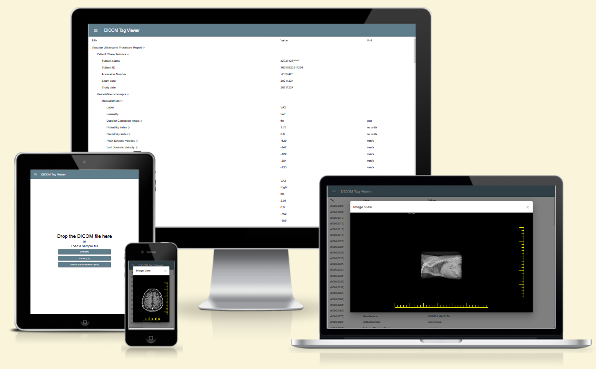

# DICOM Tag Viewer

Got some medical images in DICOM format and want to check the information or previewing image quickly? DICOM Tag Viewer is here to help!

The DICOM Tag Viewer is a user-friendly tool for displaying DICOM information in your browser. Users can simply drag-n-drop DICOM images to display tag info.

Using dynamic tables, it presents nested tag data, allowing users to search, expand, and filter columns as needed. The DICOM Tag Viewer also supports the DICOM SR (Structured Report) format.

All operations are performed on the frontend, guaranteeing that no sensitive data leaves the browser.

---

### preview:

 

### [live demo](https://dcm-tag-viewer.sean-j.dev)

## Available Scripts

| Script             | Description                                                     |
| ------------------ | --------------------------------------------------------------- |
| npm run dev        | Start the development server (http://localhost:5173)            |
| npm run build      | Build the production-ready code                                 |
| npm run cy         | Start Cypress UI                                                |
| npm run test       | Run E2E and unit tests                                          |
| npm run arc:deploy | Deploy to AWS Lambda via Architect framework (AWS key required) |

## This project utilizes the following technologies:

### Frontend

  

    
    
    
    
  

### Cloud

  

    
    
  

### CI/CD

  

    
    
    
  

